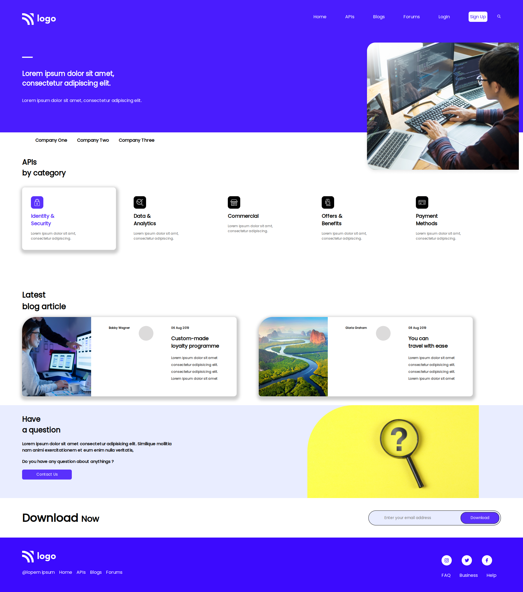

# Project 9

## `Nishok Maharaaj`

## Learnings    

In the ninth project of HTML and CSS class I have learnt every small things in CSS like `box-shadow`, `position`, `flex-box` and used it all together. Learnt more about flex-box and its properties along that.

## Efforts

This project took around 5 hours to build the webpage with the cards.Referred many articles and solutions of other developers to make this website.

### Screenshot

